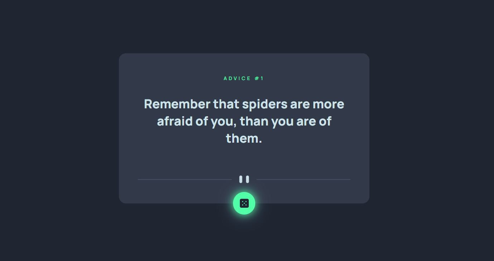
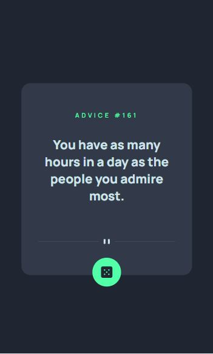

# Advice generator app

Solução para o desafio [Advice generator app no Frontend Mentor](https://www.frontendmentor.io/challenges/advice-generator-app-QdUG-13db).

- [Sobre o projeto ](#sobre-o-projeto)
- [Screenshots](#screenshots)
- [Techs](#techs)
- [Frontend Mentor](#frontend-mentor)

## Sobre o projeto

Advice Generator App é um app que mostra novos conselhos e seu número de id ao clicar no botão. Possui layout responsivo conforme o tamanho da tela do usuário, estado de foco no botão e utiliza a [Advice Slip API](https://api.adviceslip.com), uma API que disponibiliza conselhos de forma aleatória.

## Screenshots

## Techs

- HTML semântico
- CSS
- Flexbox
- Javascript
- API

## Frontend Mentor

- [@biancamarquezi](https://www.frontendmentor.io/profile/biancamarquezi)
